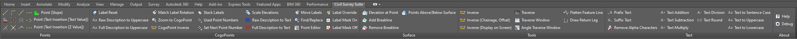

<a name="readme-top"></a>

# Civil Survey Suite

<!-- TABLE OF CONTENTS -->
<details>
  <summary>Table of Contents</summary>
  <ol>
    <li>
      <a href="#about-the-project">About The Project</a>
    </li>
    <li>
      <a href="#getting-started">Getting Started</a>
      <ul>
        <li><a href="#required-software">Required Software</a></li>
        <li><a href="#installation">Installation</a></li>
      </ul>
    </li>
    <li>
      <a href="#building-from-source">Building From Source</a>
      <ul>
        <li><a href="#prerequisites">Prerequisites</a></li>
        <li><a href="#clone-the-repository">Clone The Repository</a></li>
        <li><a href="#building-the-project">Building The Project</a></li>
      </ul>
    </li>
    <li><a href="#roadmap">Roadmap</a></li>
    <li><a href="#contributing">Contributing</a></li>
    <li><a href="#license">License</a></li>
  </ol>
</details>

<!-- ABOUT THE PROJECT -->
## About The Project



`Civil Survey Suite` a passion project of mine. It was designed to enhance surveying tasks for both surveyors and survey drafters in Autodesk Civil 3D, this plugin brings powerful enhancements tailored specifically for the surveying field. Simplify point creation, work with CogoPoint labels, tools for surfaces, generate reports and more. Civil Survey Suite is the result of a labour of love, created with a passion for improving the survey drafting experience within Civil 3D.

<p align="right">(<a href="#readme-top">back to top</a>)</p>

<!-- GETTING STARTED -->
## Getting Started

### Required Software

* AutoCAD Civil 3D (not tested below release 21.0)
* .NET Framework 4.6.1

### Installation

1. Download the latest version from [releases]([releases](https://github.com/puppetsw/CivilSurveySuite/releases)).
2. Extract the archive to the following directory.

    ```sh
    C:\Users\{username}\AppData\Roaming\Autodesk\ApplicationPlugins
    ```

3. Launch Autodesk Civil 3D and run the `cssloadcivilmenu` to load the ribbon and menu.

4. That's it!

<p align="right">(<a href="#readme-top">back to top</a>)</p>

## Building From Source

### Prerequisites

* AutoCAD Civil 3D (not tested below release 21.0)
* Visual Studio 2022
* .NET Framework 4.6.1

### Clone The Repository

```sh
git clone https://github.com/puppetsw/CivilSurveySuite
```

### Building The Project

To build Civil Survey Suite, open the CivilSurveySuite.sln solution file in Visual Studio. Right-click on the CivilSurveySuite.Loader project in solution explorer and select `Set as Startup Project`.

Make sure that following projects have references to the corresponding Autodesk DLLs from your Autodesk Civil 3D installation directories.

#### 1. CivilSurveySuite.ACAD

* accoremgd.dll
* acdbmgd.dll
* acmgd.dll
* accui.dll

#### 2. CivilSurveySuite.CIVIL

* accoremgd.dll
* acdbmgd.dll
* acmgd.dll
* aecbasemgd.dll
* aeccdbmgd.dll

#### 3. CivilSurveySuite.Loader

* acdbmgd.dll

Make sure to set the `Copy Local` property of each Autodesk reference to `False`.

## Roadmap

* [ ] More options/settings for commands to give more control.
* [ ] Point Report (compare to surface - in progress)
  * [ ] Compare with Alignment(s)
    * [ ] Control Station Format
    * [ ] Hide Non-Adjacent Points
  * [ ] Zoom to Point
  * [ ] Cut/Fill Between Surfaces at Point(s)
  * [ ] Sorting & Decimal Places
  * [ ] Export to CSV
  * [ ] Filter Points
* [ ] Comparing Two or More Surfaces
* [ ] Link CogoPoint Labels

See the [open issues](https://github.com/puppetsw/CivilSurveySuite/issues) for a full list of proposed features (and known issues).

<p align="right">(<a href="#readme-top">back to top</a>)</p>

<!-- CONTRIBUTING -->
## Contributing

If you have a suggestion that would make this better, please fork the repo and create a pull request. You can also simply open an issue with the tag "enhancement".
Don't forget to give the project a star! Thanks again!

1. Fork the Project
2. Create your Feature Branch (`git checkout -b feature/AmazingFeature`)
3. Commit your Changes (`git commit -m 'Add some AmazingFeature'`)
4. Push to the Branch (`git push origin feature/AmazingFeature`)
5. Open a Pull Request

<p align="right">(<a href="#readme-top">back to top</a>)</p>

<!-- LICENSE -->
## License

Distributed under the MIT License. See `LICENSE.md` for more information.

<p align="right">(<a href="#readme-top">back to top</a>)</p>
