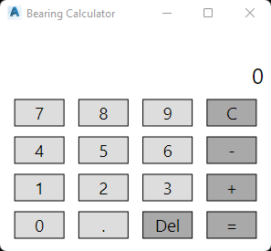

# 3DSSHOWANGLECALCULATOR

## Description

Shows a simple bearing calculator.

### Remarks

Bearings are to be entered as degrees, minutes and seconds in the following format. ``DD.MMSS``

Results are displayed in the same format. Note that the trailing zero may be truncated.

## Usage

* Run command (3DSSHOWANGLECALCULATOR)

## Example Output

```
Command: 3DSSHOWANGLECALCULATOR
```

# Screenshot

