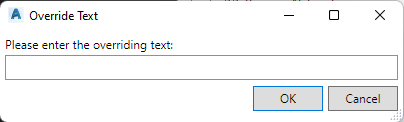

# 3DSLABELOVERRIDE

## Description

Asks for user input to override the **CogoPoint** label.

## Usage

* Run command (3DSLABELOVERRIDE)
* Select a **CogoPoint**

## Example Output

```
Command: 3DSLABELOVERRIDE
3DS> Select CogoPoints label to override:
```

## Screenshot


