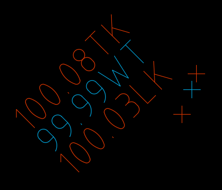

# 3DSLABELSTACK

## Description

Stacks CogoPoint Labels ontop of each other.

### Remarks

Press `ESC` to end the command.

## Usage

* Run command (3DSLABELSTACK)
* Select first **CogoPoint**
* Select the next **CogoPoint**
* Continue...

## Example Output

```
3DSLABELSTACK
3DS> Select first CogoPoint:
3DS> Select CogoPoint: Regenerating model.
3DS> Select CogoPoint: Regenerating model.
3DS> Select CogoPoint: *Cancel*
```

## Screenshot

