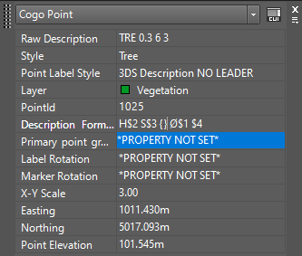

# CSSLABELLINEBREAK

## Description

Converts `{}` into a line break inside a **CogoPoint**'s description format.

### Remarks

The line break is calculated based on the width of the **Label Style**.

## Usage

* Run command (CSSLABELLINEBREAK)
* Select a **CogoPoint**

## Example Output

```
Command: CSSLABELLINEBREAK
Select CogoPoint: 1 found
Select CogoPoint:
```

## Screenshot

