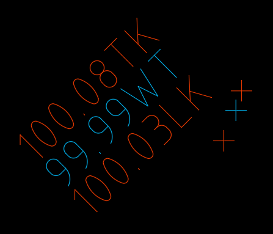

# CSSLABELSTACK

## Description

Stacks CogoPoint Labels ontop of each other.

### Remarks

Press `ESC` to end the command.

## Usage

* Run command (CSSLABELSTACK)
* Select first **CogoPoint**
* Select the next **CogoPoint**
* Continue...

## Example Output

```
CSSLABELSTACK
Select first CogoPoint:
Select CogoPoint: Regenerating model.
Select CogoPoint: Regenerating model.
Select CogoPoint: *Cancel*
```

## Screenshot

