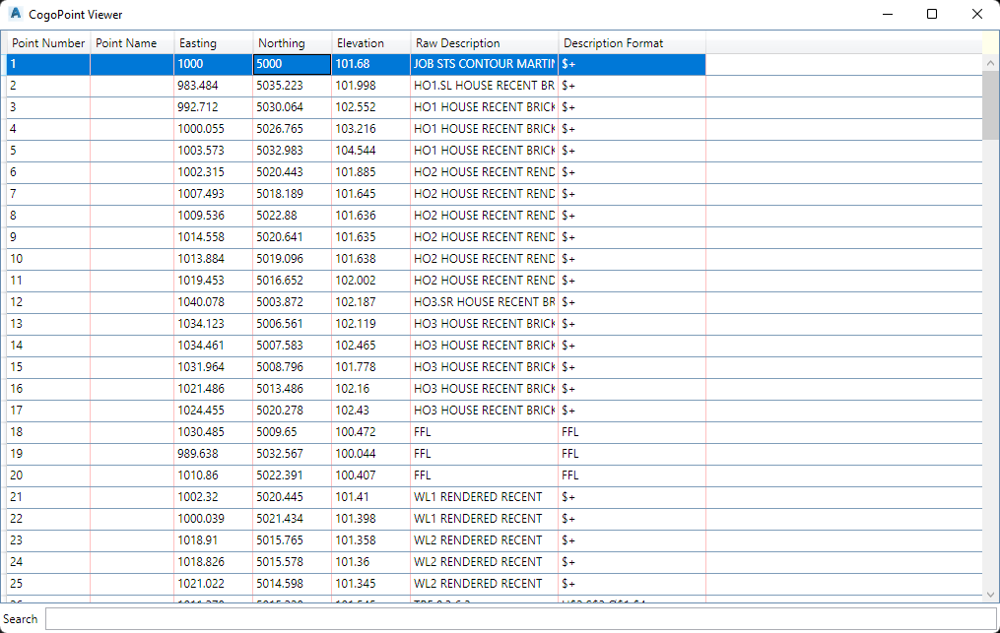

# 3DSSHOWCOGOPOINTEDITOR

## Description

Shows the **CogoPoint** editor dialog.

## Usage

* Run command (3DSSHOWCOGOPOINTEDITOR)

## Example Output

```
Command: 3DSSHOWCOGOPOINTEDITOR
```

## Screenshot


