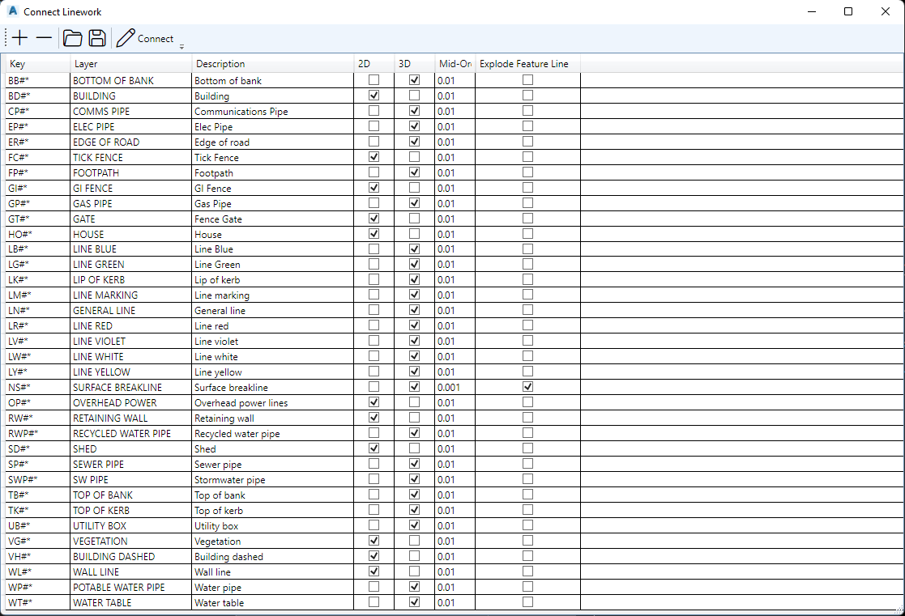

# 3DSSHOWCONNECTLINEWORKWINDOW

## Description

Shows the dialog window to draw linework between **CogoPoints**.

## Usage

* Run command (3DSSHOWCONNECTLINEWORKWINDOW)

## Example Output

```
Command: 3DSSHOWCONNECTLINEWORKWINDOW
```

## Screenshot


