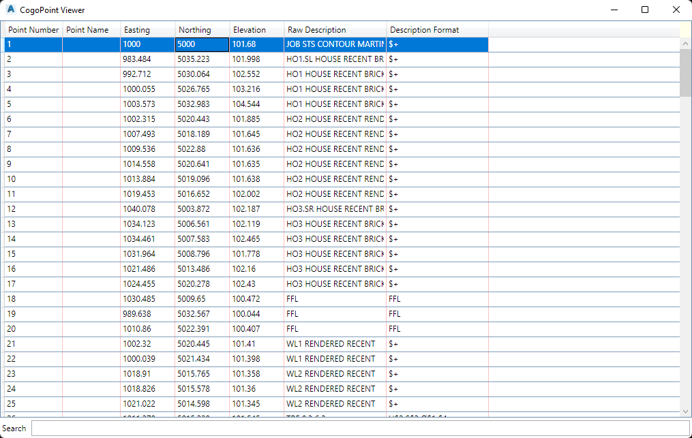

# CSSSHOWCOGOPOINTEDITOR

## Description

Shows the **CogoPoint** editor dialog.

## Usage

* Run command (CSSSHOWCOGOPOINTEDITOR)

## Example Output

```
Command: CSSSHOWCOGOPOINTEDITOR
```

## Screenshot


