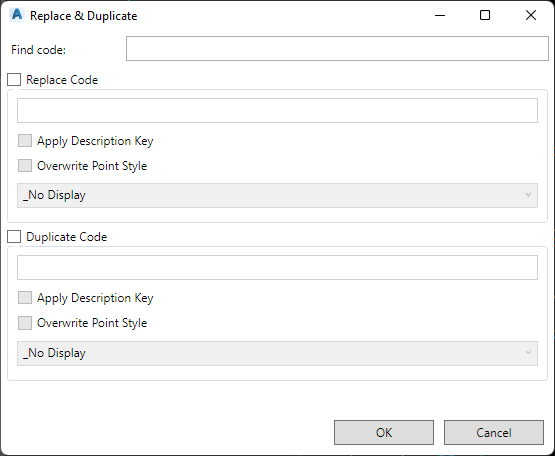

# CSSSHOWCOGOPOINTFINDREPLACE

## Description

Shows the **CogoPoint** find/replace dialog.

### Remarks


## Usage

* Run command (CSSSHOWCOGOPOINTFINDREPLACE)

## Example Output

```
Command: CSSSHOWCOGOPOINTFINDREPLACE
```

## Screenshot

