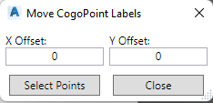

# 3DSCPTLABELSMOVE

## Description

Shows dialog to move multiple labels by specified amount.

## Usage

* Run command (3DSCPTLABELSMOVE)

## Example Output

```
Command: 3DSCPTLABELSMOVE
```

## Screenshot

